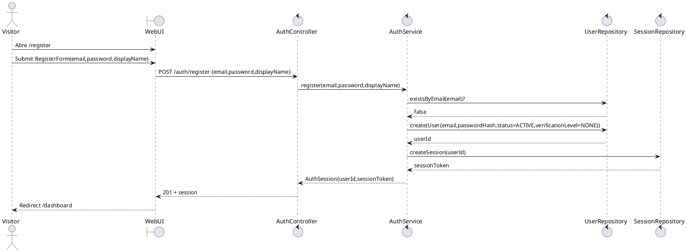
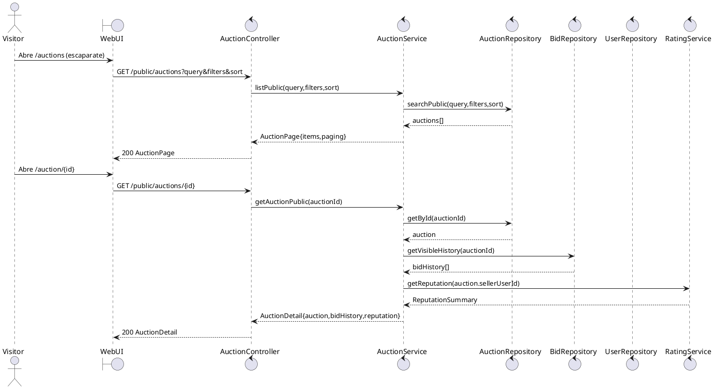
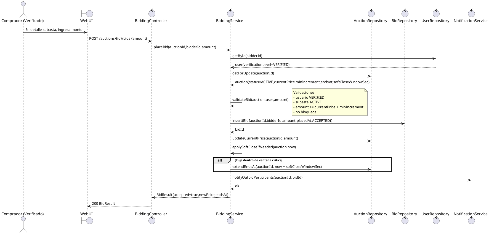
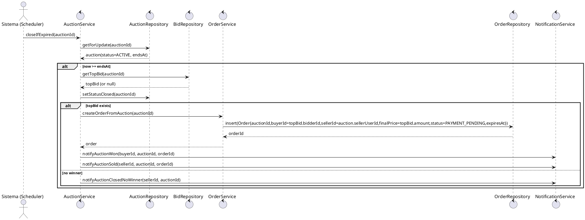
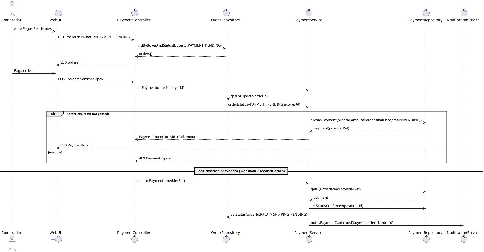
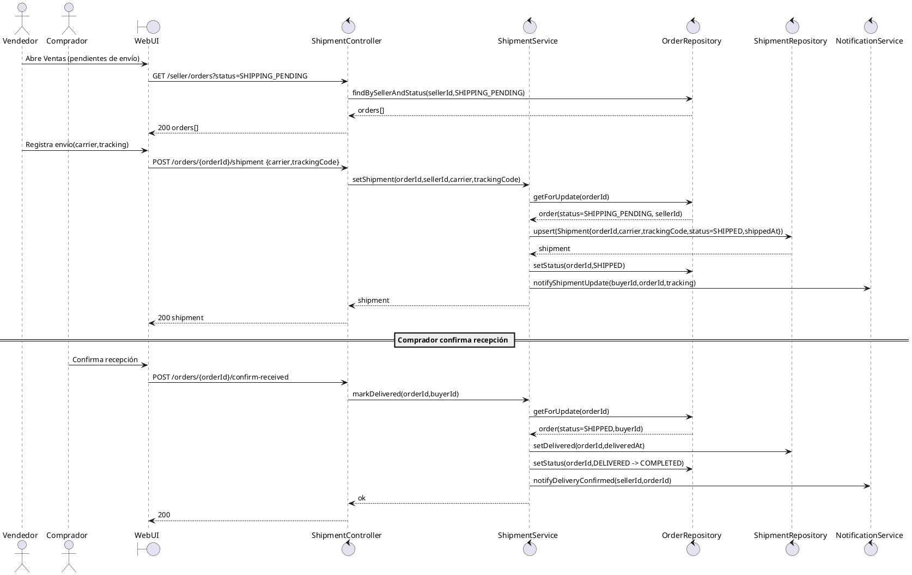
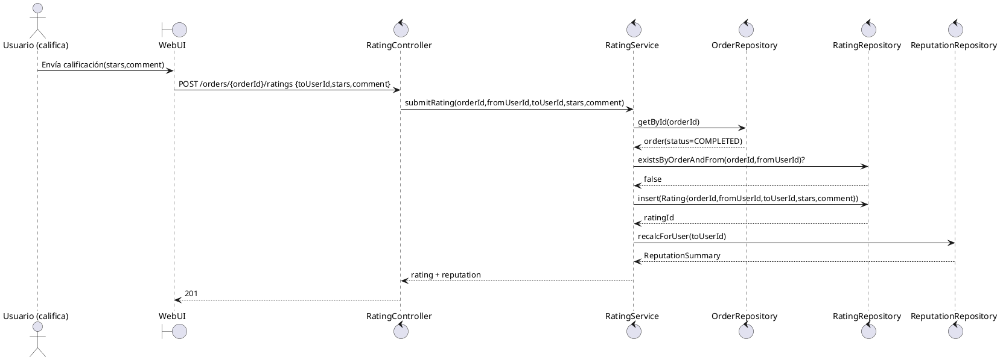
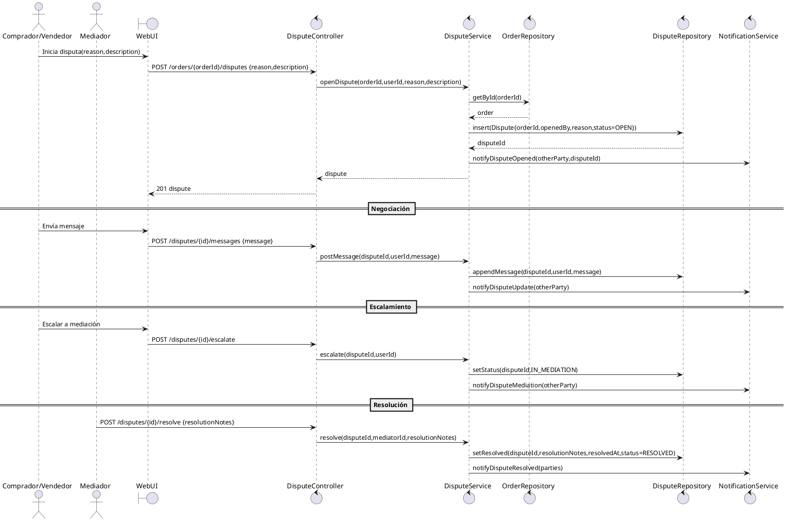

## 0) Convenciones del modelo (para leer los diagramas)

* **UI**: Web/App (público, dashboards)
* **API**: Controladores de aplicación (sin framework)
* **Services**: lógica de negocio (casos de uso)
* **Repositories**: persistencia
* **Domain Entities**: modelos centrales (Auction, Bid, Order, Shipment, Dispute, Reputation, User)

---

# 1) Diagrama de clases (Dominio + Servicios)

```plantuml
@startuml
skinparam classAttributeIconSize 0

' ======= Domain Entities =======

class User {
  +uuid id
  +string email
  +string passwordHash
  +UserStatus status
  +VerificationLevel verificationLevel
  +bool sellerEnabled
  +datetime createdAt
  +datetime lastLoginAt
}

enum UserStatus { ACTIVE; SUSPENDED; BANNED }
enum VerificationLevel { NONE; BASIC; VERIFIED }

class Profile {
  +uuid userId
  +string displayName
  +string phone
  +string addressLine1
  +string addressLine2
  +string city
  +string country
  +string postalCode
}

class SellerProfile {
  +uuid userId
  +SellerStatus status
  +datetime enabledAt
}

enum SellerStatus { PENDING; ENABLED; DISABLED }

class Auction {
  +uuid id
  +uuid sellerUserId
  +string title
  +string description
  +AuctionStatus status
  +money startPrice
  +money currentPrice
  +money minIncrement
  +datetime startsAt
  +datetime endsAt
  +int softCloseWindowSec
  +datetime createdAt
}

enum AuctionStatus { DRAFT; ACTIVE; CLOSED; CANCELLED }

class AuctionItem {
  +uuid auctionId
  +string condition
  +string category
}

class AssetImage {
  +uuid id
  +uuid auctionId
  +string url
  +int sortOrder
}

class Bid {
  +uuid id
  +uuid auctionId
  +uuid bidderUserId
  +money amount
  +datetime placedAt
  +BidStatus status
}

enum BidStatus { ACCEPTED; REJECTED }

class WatchlistItem {
  +uuid id
  +uuid userId
  +uuid auctionId
  +datetime createdAt
}

class Order {
  +uuid id
  +uuid auctionId
  +uuid buyerUserId
  +uuid sellerUserId
  +money finalPrice
  +OrderStatus status
  +datetime createdAt
  +datetime expiresAt
}

enum OrderStatus { PAYMENT_PENDING; PAID; SHIPPING_PENDING; SHIPPED; DELIVERED; COMPLETED; CANCELLED }

class Payment {
  +uuid id
  +uuid orderId
  +money amount
  +PaymentStatus status
  +string providerRef
  +datetime createdAt
  +datetime confirmedAt
}

enum PaymentStatus { PENDING; CONFIRMED; FAILED; EXPIRED }

class Shipment {
  +uuid id
  +uuid orderId
  +ShipmentStatus status
  +string carrier
  +string trackingCode
  +datetime shippedAt
  +datetime deliveredAt
}

enum ShipmentStatus { NOT_SET; SHIPPED; DELIVERED }

class Rating {
  +uuid id
  +uuid orderId
  +uuid fromUserId
  +uuid toUserId
  +int stars
  +string comment
  +datetime createdAt
}

class ReputationSummary {
  +uuid userId
  +float avgStarsAsBuyer
  +float avgStarsAsSeller
  +int ratingCountAsBuyer
  +int ratingCountAsSeller
}

class Dispute {
  +uuid id
  +uuid orderId
  +uuid openedByUserId
  +DisputeStatus status
  +DisputeReason reason
  +string description
  +datetime openedAt
  +datetime resolvedAt
  +string resolutionNotes
}

enum DisputeStatus { OPEN; IN_NEGOTIATION; IN_MEDIATION; RESOLVED; CLOSED }
enum DisputeReason { NOT_RECEIVED; NOT_AS_DESCRIBED; PAYMENT_ISSUE; OTHER }

class Notification {
  +uuid id
  +uuid userId
  +NotificationType type
  +string title
  +string body
  +bool read
  +datetime createdAt
}

enum NotificationType { OUTBID; AUCTION_ENDING; AUCTION_WON; PAYMENT_DUE; PAYMENT_CONFIRMED; SHIPMENT_UPDATE; DISPUTE_UPDATE }

' ======= Relationships =======
User "1" -- "1" Profile
User "0..1" -- "1" SellerProfile
Auction "1" -- "1" AuctionItem
Auction "1" -- "*" AssetImage
Auction "1" -- "*" Bid
User "1" -- "*" Bid
User "1" -- "*" WatchlistItem
Auction "1" -- "*" WatchlistItem
Auction "1" -- "0..1" Order
Order "1" -- "0..1" Payment
Order "1" -- "0..1" Shipment
Order "1" -- "*" Rating
Order "1" -- "*" Dispute
User "1" -- "*" Notification

' ======= Application Services =======
class AuthService {
  +register(email, password, displayName): User
  +login(email, password): AuthSession
  +recoverAccess(email): void
}

class AuctionService {
  +listPublic(query, filters, sort): AuctionPage
  +getAuctionPublic(auctionId): AuctionDetail
  +createDraft(sellerId, payload): Auction
  +publish(auctionId, sellerId): Auction
  +closeIfExpired(auctionId): void
}

class BiddingService {
  +placeBid(auctionId, bidderId, amount): BidResult
  +validateBid(auction, bidder, amount): void
  +applySoftCloseIfNeeded(auction, now): Auction
}

class OrderService {
  +createOrderFromAuction(auctionId): Order
  +getBuyerOrders(buyerId): OrderPage
  +getSellerOrders(sellerId): OrderPage
  +markDelivered(orderId, buyerId): Order
}

class PaymentService {
  +initPayment(orderId, buyerId): PaymentIntent
  +confirmPayment(providerRef): Payment
  +expireOverduePayments(): void
}

class ShipmentService {
  +setShipment(orderId, sellerId, carrier, trackingCode): Shipment
  +markDelivered(orderId): Shipment
}

class RatingService {
  +submitRating(orderId, fromUserId, toUserId, stars, comment): Rating
  +getReputation(userId): ReputationSummary
}

class DisputeService {
  +openDispute(orderId, userId, reason, description): Dispute
  +postMessage(disputeId, userId, message): void
  +escalate(disputeId, userId): Dispute
  +resolve(disputeId, mediatorId, resolutionNotes): Dispute
}

@enduml
```

---

# 2) Secuencia: Registro + Login



---

# 3) Secuencia: Explorar escaparate + ver detalle



---

# 4) Secuencia: Pujar + validación + soft-close + notificación



---

# 5) Secuencia: Cierre automático + crear Order + notificar



---

# 6) Secuencia: Pago (buyer) + confirmar pago

> Nota: aquí lo dejo **agnóstico** a proveedor (sin “escrow” fijo), tal como el documento maestro.



---

# 7) Secuencia: Vendedor registra envío + comprador confirma recepción



---

# 8) Secuencia: Calificar (buyer/seller) + actualizar reputación



---

# 9) Secuencia: Disputa + negociación + escalamiento + mediación


