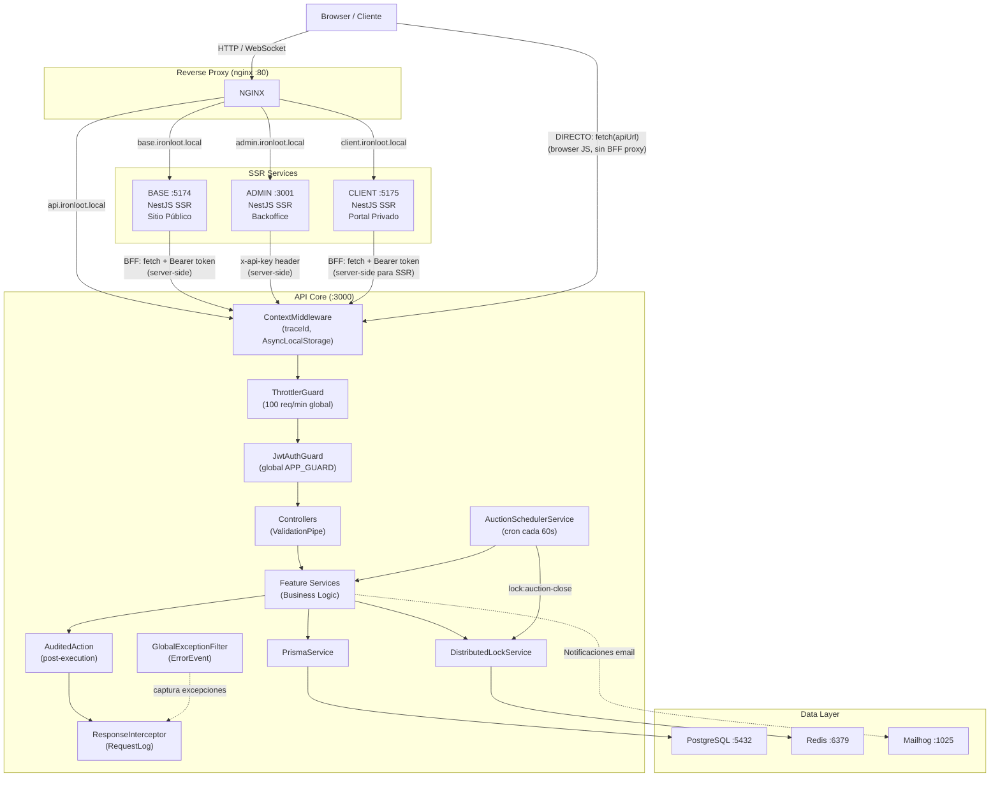
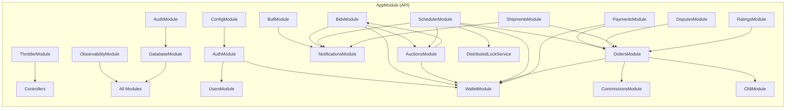

# F1 — Mapa del Sistema

**Sistema:** IronLoot v1.0.0  
**Fecha:** 2026-06-23  
**Fuente:** `src/api/src/app.module.ts`, `src/apps/*/src/app.controller.ts`, `src/nginx/nginx.conf`, `docs/enterprise-documentation/06-Backend-Architecture.md`

---

## 1. Flujo de Requests — Diagrama Mermaid

**⚠️ OBSERVACIÓN CLAVE (ND-007):** El sitio CLIENT pasa `apiUrl` a los templates Nunjucks. Los scripts JavaScript del browser en CLIENT pueden llamar directamente al API (`fetch(apiUrl + endpoint)`) sin pasar por el proxy BFF server-side. Esto crea una ruta de llamadas directas browser→API cuyo mecanismo de autenticación no está completamente verificado. Se registra como candidato a hallazgo D2/D3.

---

## 2. Dependencias de Módulos — Diagrama Mermaid

---

## 3. Confrontación con Documentación

| Afirmación documentada | Fuente doc | Verificado | Observación |
|:---|:---|:--:|:---|
| BFF: JWT en HttpOnly cookie → extraído server-side | 09-Security-Architecture.md | ✅ | `getToken(req)` extrae de `req.cookies.access_token` |
| CLIENT NO expone token al JS del browser | 09-Security-Architecture.md | ⚠️ | CLIENT pasa `apiUrl` a templates; JS del browser puede hacer fetch directo |
| ThrottlerModule usa backend Redis | (implícito en multi-instance) | ❌ | `ThrottlerModule.forRootAsync` sin `ThrottlerStorageRedis` — usa memoria (ND-002) |
| API global APP_GUARD = JwtAuthGuard | 06-Backend-Architecture.md | ✅ | Confirmado en `app.module.ts:140-151` |
| Audit: RequestLog por cada request | 03-TRD.md | ✅ | `ResponseInterceptor` / `RequestLogInterceptor` en pipeline |
| Distributed lock en scheduler | 03-TRD.md | ✅ | `DistributedLockService.acquireLock('lock:auction-close', 60)` |
| Admin usa `x-api-key` en todos los calls | 06-Backend-Architecture.md | ✅ | `AdminApiClient` inyecta header en cada call |

---

## 4. Desvíos doc↔realidad (candidatos D4)

| ID | Desvío | Severidad probable |
|:---|:---|:---|
| D4-CAN-001 | 09-Security-Architecture.md afirma que CLIENT JS nunca tiene acceso a JWT — pero `apiUrl` en templates permite fetch directo | MEDIA |
| D4-CAN-002 | ThrottlerModule documentado como protección multi-instancia — pero sin Redis backend es solo efectivo en instancia única | MEDIA |

Estos candidatos se convertirán en hallazgos en F5/F7 con evidencia formal.

---

## Checklist F1 ✅

- [x] Diagrama Mermaid de flujo de requests (entrada → router → handler → producto)
- [x] Diagrama Mermaid de dependencias de módulos
- [x] Confrontación con diagramas documentados → desvíos listados (2 candidatos)

**Estado: COMPLETADA** | Confidence: 92%
