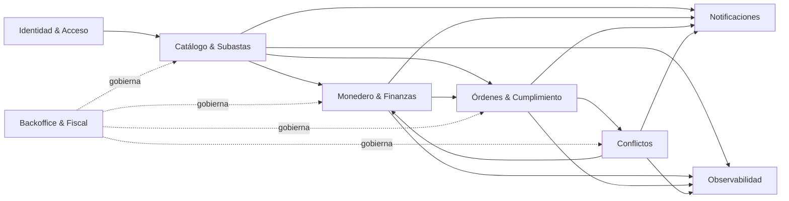

# DDD y Bounded Contexts — IronLoot

| Metadato | Valor |
|---|---|
| **Origen** | Reconstrucción basada en evidencia |
| **Fuente** | `audit/raw/C/F`, `src/packages/core/src/*`, `prisma/schema.prisma` |
| **Fecha** | 2026-07-23 |
| **Documentos usados** | 06-Backend §7, 07-Database |
| **Código usado** | `packages/core` (domain/application/contracts/events/integrations), `src/api/src/modules` |
| **Nivel de confianza** | Alto |

## 1. Bounded contexts y context map

| Contexto | Responsabilidad | Relación |
|---|---|---|
| Identidad & Acceso | usuarios, sesiones, 2FA, perfiles, métodos de pago | upstream de todos |
| Catálogo & Subastas | subastas, pujas, watchlist, ciclo de vida | conformista con Finanzas (bloqueo) |
| Monedero & Finanzas | wallet, ledger, captura, comisión | shared kernel de dinero |
| Órdenes & Cumplimiento | órdenes, envíos, calificaciones | downstream de Subastas |
| Conflictos | disputas, reembolsos | invoca Finanzas: la resolución reembolsa vía `WalletService.reversarVenta()` (`AUD-010` corregido, PT-191) |
| Backoffice & Fiscal | moderación, KYC, CFDI, comisiones, CMS/SEO, config | gobierna vía AdminService (god-object) |
| Observabilidad | audit/error/request logs, diagnostics | genérico transversal |
| Notificaciones | in-app + email + campañas | genérico transversal |

## 2. Shared kernel: `@ironloot/core`

Capas (`packages/core/src/`): `domain/` (reglas hoja), `application/` (use-cases), `contracts/` (puertos de repositorio), `events/`, `integrations/` (puertos externos). `[F §1]`

### Agregados y raíces
| Agregado | Raíz | Invariantes clave | Ubicación |
|---|---|---|---|
| Subasta | Auction | transiciones válidas; scheduler bloqueado en moderación/suspensión | `auction-state-machine.ts` |
| Orden | Order | transiciones PENDING_PAYMENT→…→REFUNDED | `order-state-machine.ts` |
| Disputa | Dispute | ventana 14 días; OPEN→…→CLOSED | `dispute-state-machine.ts` |
| Monedero | Wallet | disponible = balance − held; `canLockFunds` | `wallet-calculation.ts` |

### Value Objects
- **Money** — **retirado en PT-191** (`AUD-012` corregido). Ningún servicio lo importaba, y cablearlo habría sido una regresión: guardaba centavos en un `number` mientras las columnas son `Decimal(12,2)`, y su constructor rechaza negativos, que el descubierto del vendedor necesita.
- DTOs de dinero/paginación (`shared/`).

### Validadores de dominio
- **BidValidation** — activo / >0 / no-vendedor / >actual (sin incremento mínimo, `AUD-009`).
- **WebhookSignatureValidator** (HMAC timing-safe) y **IpnValidator** (PayPal).

### Casos de uso (application) ⚠️
`PlaceBidUseCase`, `CloseAuctionUseCase`, `ProcessPaymentUseCase`, `ProcessRefundUseCase` — dependen sólo de puertos `contracts/`. **Retirados por ADR-033** (`AUD-012` corregido): la orquestación vive en los services, y conservar una copia sin cablear sólo producía cobertura que no cubría nada.

### Puertos (contracts / integrations)
- Repositorios: `auction/bid/order/wallet-repository.interface.ts`.
- Integraciones: `payment-provider`, `email-service`, `storage-service`, `cfdi-pac-provider` (`ICfdiPacProvider` sin implementación concreta, `AUD-016`).

### Eventos de dominio
`bid.placed`, `auction.closed`, `order.created`, `payment.completed`, `refund.processed`.

## 3. Lenguaje ubicuo

Definido una sola vez en el [Diccionario Maestro](../transversal/Diccionario-Maestro.md). Términos núcleo: Subasta, Puja, Soft-close, Wallet, Held funds, Ledger, Orden, Comisión, Disputa, Reembolso, KYC, CFDI, Producto-PTSA.

## 4. Anti-patrones detectados (a gobernar)

| Anti-patrón | Descripción | Hallazgo |
|---|---|---|
| God-object | AdminController/Service concentran 18 áreas | `E §1` |
| Superficie huérfana en `core` | 24 símbolos exportados sin consumidor: los puertos hexagonales sin adaptador. Contados y con guarda que impide que crezcan | `TD-024` (AUD-012 corregido) |
| ~~Bypass de invariantes~~ | resuelto: el admin pasa por `AuctionStateMachine` (puerta única `transicionar()`) | AUD-011 corregido, PT-191 |
| Referencia sin FK | modelos backoffice con refs libres | AUD-001 |

> Modelo de datos físico completo en [4-ingenieria/Modelo-de-Datos.md](../4-ingenieria/Modelo-de-Datos.md); entidades en [Modelo Maestro de Dominio](../transversal/Modelo-Maestro-de-Dominio.md).
