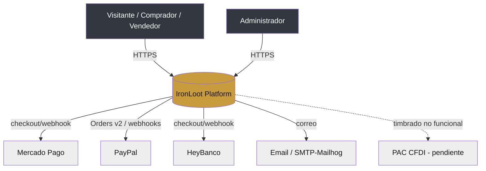

# Software Architecture Document (SAD) — IronLoot

| Metadato | Valor |
|---|---|
| **Origen** | Reconstrucción basada en evidencia (reconcilia 06-Backend con Graphify y código) |
| **Fuente** | `audit/raw/B/E`, `graphify-out/GRAPH_REPORT.md`, `docker-compose.yml`, `src/nginx/nginx.conf`, código |
| **Fecha** | 2026-07-23 |
| **Documentos usados** | 06-Backend-Architecture, 03-TRD, 09-Security |
| **Código usado** | `src/api`, `src/apps/*`, `src/admin`, `src/packages/core`, `src/nginx` |
| **Nivel de confianza** | Alto |

## 1. Visión general

IronLoot es un **monorepo multi-servicio** (ADR-001): 4 apps NestJS + 1 librería de dominio, tras un reverse proxy nginx. Grafo real (Graphify): **1307 nodos, 2690 aristas, 65 comunidades**; god-object `AdminController/Service` (80/72 aristas). `[E §1]`

## 2. C4 — Nivel 1: Contexto



- Proveedores externos: Mercado Pago, PayPal, **HeyBanco** (no documentado antes, `AUD-023`), SMTP; PAC para CFDI **pendiente** (`AUD-016`).

## 3. C4 — Nivel 2: Contenedores

```mermaid
graph TB
  subgraph Edge
    NG[nginx :80<br/>routing por subdominio]
  end
  BASE[BASE SSR :5174<br/>público, BFF proxy]
  CLIENT[CLIENT SSR :5175<br/>privado]
  ADMIN[ADMIN SSR :3001<br/>backoffice, sesión Redis]
  API[API REST+WS :3000<br/>/api/v1, 27 módulos]
  CORE[[@ironloot/core<br/>dominio sin HTTP/DB]]
  DB[(PostgreSQL 16)]
  REDIS[(Redis 7<br/>lock, sesión, BullMQ)]
  NG --> BASE & CLIENT & ADMIN & API
  BASE -->|BFF Bearer| API
  CLIENT -->|BFF render / ✗ escrituras directas| API
  ADMIN -->|admin JWT / x-admin-key| API
  API --> DB
  API --> REDIS
  API -. importa .-> CORE
  BASE & CLIENT & ADMIN -. importan .-> CORE
```

| Contenedor | Puerto | Rol | Notas |
|---|---|---|---|
| nginx | 80 | Reverse proxy, traffic-switch | `nginx.conf` |
| BASE | 5174 | Sitio público + BFF | proxy `/api` correcto |
| CLIENT | 5175 | Portal privado | **sin proxy `/api`** (`AUD-003`) |
| ADMIN | 3001 | Backoffice | **sin Helmet/CSP/CSRF** (`AUD-007`) |
| API | 3000 | REST + WebSockets | prefijo `/api/v1`, 27 módulos |
| core | — | Dominio compartido | FSM/validadores usados; use-cases/Money no (`AUD-012`) |
| PostgreSQL | 5432 | Persistencia | Prisma; drift de migraciones (`AUD-001`) |
| Redis | 6379 | Lock/sesión/colas | lock de cierre, sesión admin, BullMQ |

## 4. C4 — Nivel 3: Componentes (API)

27 módulos de feature (`src/api/src/modules/`) + `common/`. Agrupación por bounded context en [Modelo Maestro de Dominio §1](../transversal/Modelo-Maestro-de-Dominio.md). Componentes centrales:

- **BidsService** — hub de la puja: inyecta Prisma, WalletService, NotificationsService, AuditPersistence, AuctionsGateway, SystemConfig. `[B §6]`
- **AuctionSchedulerService** — cron + DistributedLock + EventEmitter2.
- **WalletService** — balance/held/ledger + fee de captura.
- **AdminService** — umbrella que expone commissions/kyc/cfdi/refunds/seo/cms (esos módulos **no tienen controller propio**) → god-object (`E §1`).
- **PaymentsService** — abstracción de proveedores (MP/PayPal/HeyBanco/Stripe-cond.).

## 5. Pipeline de petición

```
Request → nginx → (App SSR: BFF inyecta Authorization) → API
   → Middleware (helmet, cookieParser, throttler)
   → Guards (JwtAuthGuard global | @Public | AdminDualAuthGuard | DevOnly)
   → Controller → Service → (Prisma | core FSM/validators | providers)
   → Interceptors (audit/log) → Exception filters
```

## 6. C4 — Nivel 4: Despliegue

8 servicios Docker en red bridge `ironloot-network`; healthchecks en api/admin/base/client/db/redis; pgadmin bajo perfil `tools`. Detalle en [6-devops](../6-devops/Arquitectura-de-Despliegue.md). `[E §3]`

## 7. Real-time y asíncrono

- **WebSockets:** namespaces `auctions` (`bid:new`, `auction:extended`, `auction:ended`) y `events`. **Sin autenticación** (`AUD-006`), y **sin cliente en el frontend** (`AUD-002`).
- **Colas:** BullMQ sobre Redis (notificaciones, reintentos de webhook) `[E §5]`.
- **Eventos de dominio:** `EventEmitter2` (`auction.closed`, etc.).

## 8. Atributos de calidad (estado real)

| Atributo | Mecanismo | Estado |
|---|---|---|
| Seguridad | JWT+2FA, throttler, webhooks HMAC, secretos gated | ⚠️ AUD-004/006/007/014 |
| Consistencia financiera | TX Prisma + lock Redis + Ledger inmutable | ⚠️ AUD-005/008/012 |
| Escalabilidad | Cierre idempotente con lock; stateless API | ✅ |
| Observabilidad | Audit/Error/Request logs + traceId | ⚠️ AUD-018 |
| Mantenibilidad | Dominio en core; convenciones | ⚠️ god-object admin; core infrautilizado |

> Decisiones que sustentan esta arquitectura: [Registro Maestro de ADR](../transversal/Registro-Maestro-de-ADR.md).
