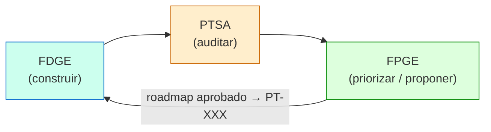

# Framework de Priorización Gobernada por Evidencia (FPGE)

> **Posición:** tercer marco de la suite. Cierra el ciclo entre desarrollo (FDGE) y auditoría (PTSA).
> **Fuente de verdad del método:** este documento. **Implementación operativa:** [FPGE-Implementation.md](FPGE-Implementation.md).
> **Marcos hermanos:** [Framework-FDGE.md](Framework-FDGE.md) (desarrollo) · [PTSA/PTSA-V3-Especificacion-Oficial.md](PTSA/PTSA-V3-Especificacion-Oficial.md) (auditoría).

---

## Filosofía

El desarrollo asistido por IA tiene un punto ciego entre dos actividades que ya están bien gobernadas:

* **FDGE** gobierna *cómo se construye* (comprensión → estrategia → ejecución → evidencia → validación).
* **PTSA** gobierna *si lo construido es válido* para su dominio (evidencia → score → certificación).

Ambos funcionan. Pero entre el final de una auditoría y el inicio del siguiente desarrollo hay una
decisión que casi siempre se toma **sin gobierno**:

> ¿Qué construimos a continuación, y por qué eso y no otra cosa?

Esa decisión suele tomarse por intuición, por recencia ("lo último que se rompió"), por la voz más
fuerte, o por el hallazgo que se recuerda — no por la evidencia agregada. El resultado es trabajo que
no ataca los problemas de mayor impacto, hallazgos críticos que envejecen mientras se hacen mejoras
cosméticas, y un Score de salud que no mejora pese a la actividad constante.

FPGE establece el principio simétrico a los otros dos marcos:

### Ninguna priorización puede comenzar antes de existir evidencia suficiente. Ninguna decisión de "qué construir" puede tomarse fuera de la evidencia de auditoría e historia.

FPGE no decide *cómo* hacer el trabajo (eso es FDGE) ni *si* el producto es válido (eso es PTSA).
FPGE decide **qué trabajo merece hacerse a continuación**, y lo justifica con evidencia trazable.

---

## Posición en el ciclo



```
FDGE (construir) → PTSA (auditar) → FPGE (priorizar/proponer) → FDGE (construir lo siguiente) → …
```

FPGE es la **bisagra del ciclo**. Lee lo que produjeron los otros dos, sintetiza, prioriza y propone.
No ejecuta desarrollo ni audita: emite un plan y lo entrega a FDGE para que comience un nuevo ciclo.

---

## Principios fundamentales

### 1. Priorización gobernada por evidencia
Todo ítem propuesto debe citar su evidencia de origen: un hallazgo `H-XXX` de PTSA, una entrada de
`HISTORY.log`, una recomendación de `HANDOFF.md`, una tendencia de `score-history.json`. Un ítem sin
evidencia de origen no es un candidato — es una opinión, y se descarta o se convierte en investigación.

### 2. Independencia de los marcos (no fusión)
FPGE es **read-only** sobre los artefactos de FDGE y PTSA. Nunca los modifica. Escribe únicamente su
propio artefacto (`ROADMAP.md`). Esto preserva la integridad de las dos entidades: ni el desarrollo ni
la auditoría dependen de FPGE para operar, y FPGE puede retirarse sin romper a ninguno.

### 3. Supremacía del dominio heredada
FPGE hereda la Regla del Agua Potable de PTSA: los hallazgos de **D1 (dominio)** pesan más que los de
D2/D3/D4 en igualdad de condiciones. Un sistema con técnica impecable pero producto inválido debe ver,
en su roadmap, las correcciones de dominio por encima de las mejoras técnicas.

### 4. Compuerta humana (la IA propone, el humano dispone)
FPGE **propone**; el humano **decide** qué entra a FDGE. FPGE jamás inicia desarrollo por sí mismo ni
convierte hallazgos en tareas automáticamente. Esto es coherente con la disciplina de ACK de FDGE y la
prohibición de auto-cierre de PTSA: las decisiones irreversibles las gobierna el humano.

### 5. Reproducibilidad
Dos ejecuciones de FPGE sobre el mismo estado (mismos hallazgos, misma historia) deben producir el
mismo orden de prioridad. La priorización es una función determinista de la evidencia, no un juicio
irrepetible (ver "Algoritmo de priorización").

### 6. Trazabilidad bidireccional
Cada ítem del roadmap apunta hacia atrás (a su evidencia de origen) y hacia adelante (al PT-XXX que
genera si se aprueba). Así, meses después, cualquiera puede responder "¿por qué hicimos esto?" con
"porque el hallazgo H-008 de severidad ALTA en el producto P-008 lo motivó, y se aprobó el 2026-06-20".

---

## Entradas (qué lee FPGE)

FPGE consume, **sin modificarlos**, los artefactos de los otros dos marcos más fuentes auxiliares.

### Desde PTSA (auditoría)
| Artefacto | Qué aporta a la priorización |
|:---|:---|
| `PTSA/RESUMEN.md` | Health/Risk/Confidence y score por dimensión: el "estado de salud" base. |
| `PTSA/Hallazgos/H-XXX.md` | Hallazgos activos con dimensión, severidad, impacto, probabilidad, riesgo → candidatos primarios. |
| `PTSA/Productos/P-XXX.md` | Productos en `RECHAZADO_DOMINIO` / `REQUIERE_REVISION` → candidatos de corrección. |
| `PTSA/PENDIENTES.md` | Bloqueantes de auditoría → posibles precondiciones de sprints. |
| `PTSA/score-history.json` | Tendencia: ¿qué dimensión se estanca o regresa? → urgencia. |

### Desde FDGE (desarrollo)
| Artefacto | Qué aporta a la priorización |
|:---|:---|
| `docs/implementation/HISTORY.log` | Qué se hizo, qué se difirió, deuda declarada, branch y delta real vs planificado → contexto y candidatos diferidos. |
| `docs/implementation/HANDOFF.md` | Estado actual, bugs abiertos, validaciones pendientes, "recommended next actions". |
| `PLAN_ACTUAL.md` / `PENDING_TASKS.md` | Trabajo en vuelo (TRIVIAL) → evitar duplicar lo ya planificado. |
| `ENRICHMENT.md` / `REFACTOR_SCOPE.md` | Especificaciones de features y refactors ya enriquecidos pero aún no implementados → candidatos con criterios de aceptación ya definidos. |
| `changes/[PT-ID]-[slug]/` | Proposal Packages en vuelo o archivados → trabajo ya planificado en detalle; evitar proponer algo que ya tiene propuesta aprobada o completada. |

### Auxiliares (opcionales)
| Fuente | Uso |
|:---|:---|
| graphify (`graphify-out/`) | Acoplamiento/arquitectura: estimar esfuerzo y radio de impacto de un cambio. |
| Historia de git (PT-XXX) | Confirmar qué entró realmente y cuándo. |

---

## Salidas (qué produce FPGE)

FPGE produce **un solo artefacto vivo**: el roadmap priorizado (`docs/implementation/ROADMAP.md`),
sobrescrito en cada corrida, más un log histórico append-only de corridas y decisiones.

### Schema de un ítem de roadmap
Cada candidato priorizado contiene:

| Campo | Descripción |
|:---|:---|
| `rank` | Posición en el orden de prioridad (1 = primero). |
| `id` | Identificador del candidato, `R-XXX` (Roadmap item). Estable entre corridas. |
| `tipo` | Clasificación FDGE sugerida: `BUG` · `FEATURE` · `REFACTOR` · `INVESTIGATION`. |
| `titulo` | Qué se propone hacer, en una línea accionable. |
| `origen` | Evidencia que lo motiva: `H-XXX`, entrada de `HISTORY.log`, `HANDOFF.md`, tendencia. |
| `producto_dim` | Producto afectado (`P-XXX`) y dimensión PTSA impactada (D1–D5). |
| `delta_score` | Ganancia de Health esperada si se ejecuta (Σ penalización que removería). |
| `esfuerzo` | Estimación: `S` / `M` / `L` (con base en graphify/acoplamiento si está disponible). |
| `riesgo_no_hacer` | Exposición de **no** hacerlo (hereda Risk de PTSA si nace de un hallazgo). |
| `priority` | Valor numérico del algoritmo (ver abajo). |
| `estado` | `PROPUESTO` · `APROBADO` · `PROMOVIDO` (a PT-XXX) · `DESCARTADO` · `DIFERIDO`. |
| `pt_asignado` | PT-XXX al que se promovió (cuando aplica). |

Además, cada ítem lleva un bloque corto de **racional**: por qué importa y qué evidencia lo respalda.

---

## Algoritmo de priorización (reproducible)

FPGE reutiliza como columna vertebral el **orden de priorización de PTSA (§29 de la especificación
oficial)** y le añade dos factores que la auditoría no considera: esfuerzo (quick wins) y contexto
histórico (deuda diferida que ya reincidió).

### Valor de prioridad
```
Priority(item) = (EvidenceWeight × ScoreImpact × Urgency × DomainMultiplier) / Effort
```

| Factor | Definición | Rango |
|:---|:---|:---|
| `EvidenceWeight` | Riesgo del hallazgo de origen (Impacto×Probabilidad de PTSA), o peso fijo si nace de HISTORY/HANDOFF. | 1–16 |
| `ScoreImpact` | Ganancia de Health esperada (penalización removida × peso de la dimensión). | 0–30 |
| `Urgency` | 1.0 base; +0.5 si `audit_due` vencido; +0.5 si la dimensión está STALE o en regresión según score-history. | 1.0–2.0 |
| `DomainMultiplier` | 1.5 si el ítem es D1 (dominio); 1.0 en otro caso. Operacionaliza la Regla del Agua Potable. | 1.0 / 1.5 |
| `Effort` | 1 (S), 2 (M), 4 (L). Divisor: a igual valor, lo barato sube. | 1 / 2 / 4 |

### Orden y desempates
1. Mayor `Priority` primero.
2. A empate: **D1 antes que D2/D3/D4** (supremacía del dominio).
3. A empate: mayor riesgo de no hacerlo.
4. A empate: menor `id` (estabilidad reproducible).

### Quick wins vs. apuestas grandes
El divisor por esfuerzo hace que FPGE proponga **una mezcla**: arriba aparecen tanto las correcciones
de dominio de alto impacto como los "quick wins" baratos. El roadmap separa explícitamente, en su
encabezado, los **3 ítems de mayor impacto** y los **3 quick wins** para que la decisión humana sea informada.

---

## La compuerta humana

FPGE termina su corrida emitiendo el roadmap y **deteniéndose**. No promueve nada por sí mismo.

```
FPGE corre → ROADMAP.md (todos PROPUESTO) → STOP
   ↓ (decisión humana)
Humano marca ítems APROBADO / DIFERIDO / DESCARTADO
   ↓
Por cada APROBADO → se promueve a FDGE STATE 1 con un PT-XXX nuevo (estado PROMOVIDO)
   El tipo del ítem determina la variante de STATE 1 que recibe:
     BUG         → STATE 1-B (Discovery)
     FEATURE     → STATE 1-E (Enrichment) — el racional del ítem sirve como contexto inicial
     REFACTOR    → STATE 1-R (Scope Definition)
     INVESTIGATION → STATE 1-B (Discovery, modo investigación)
   ↓
FDGE ejecuta su ciclo normal (State 1 → Proposal Gate → Implementación → Validación → History/Handoff)
```

La promoción de un ítem `R-XXX` a una tarea `PT-XXX` es el **único punto de contacto de escritura**
hacia FDGE, y lo dispara el humano, no FPGE. Esto mantiene intacta la disciplina de ACK de FDGE
(incluyendo el Proposal Gate que FDGE ejecuta antes de abrir cualquier rama).

---

## Contrato con FDGE y PTSA

> Esta sección absorbe y actualiza el antiguo `Interaction-Model.md` (basado en Cascada/PTSA v2),
> que queda retirado. El contrato ahora es a tres bandas.

### Independencia
Los tres marcos son independientes por diseño. Ninguno depende de otro para operar:
* FDGE puede ejecutarse sin que exista una auditoría PTSA ni un roadmap FPGE.
* PTSA puede auditar cualquier codebase, haya o no sido construido con FDGE.
* FPGE puede retirarse y el ciclo sigue funcionando de forma manual.

FPGE **no fusiona** las dos entidades: las conecta. La preferencia de mantener desarrollo y auditoría
como entidades separadas se preserva — FPGE es una tercera entidad, no un solvente de las otras dos.

### Dirección de los flujos
| Flujo | Naturaleza | Mecanismo |
|:---|:---|:---|
| PTSA → FPGE | Lectura | FPGE lee hallazgos, productos, scores. Read-only. |
| FDGE → FPGE | Lectura | FPGE lee HISTORY.log, HANDOFF.md. Read-only. |
| FPGE → FDGE | Escritura gobernada | Ítems aprobados se promueven a PT-XXX (decisión humana). |
| FPGE → PTSA | **Ninguno** | FPGE nunca escribe en PTSA. Las correcciones las re-audita PTSA por su cuenta (delta sync). |

### Dependencias indirectas
* **FPGE depende de la vigencia de PTSA:** un Score obsoleto produce un roadmap que prioriza problemas
  ya resueltos. FPGE debe verificar `score_freshness` y, si está `STALE`, recomendar un delta sync de
  PTSA **antes** de confiar en su propio orden.
* **FPGE depende de la completitud de HISTORY.log:** sin historia, FPGE no puede detectar deuda diferida
  recurrente ni evitar proponer lo ya hecho.

---

## Modos de operación (triggers)

FPGE se activa **solo a petición** (como PTSA), nunca automáticamente:

| Trigger | Acción |
|:---|:---|
| `[START FPGE]` / `roadmap FPGE` | Corrida completa: leer evidencia, sintetizar, priorizar, emitir `ROADMAP.md`, detenerse. |
| `prioritize FPGE` | Igual que la corrida completa (alias). |
| `promote FPGE R-XXX` | Promover un ítem aprobado a FDGE STATE 1 con un PT-XXX nuevo. |
| `status FPGE` | Reportar el roadmap vigente y el estado de cada ítem, sin recomputar. |

---

## Antipatrones

* **Priorizar por recencia:** atender "lo último que falló" en lugar de lo de mayor impacto/riesgo.
* **Roadmap sin evidencia:** ítems que no citan un `H-XXX`, una entrada de historia o una tendencia.
* **Auto-promoción:** convertir hallazgos en PTs sin decisión humana (rompe la compuerta).
* **Escribir en PTSA o FDGE:** FPGE solo escribe su propio roadmap; tocar artefactos ajenos rompe la independencia.
* **Confiar en un Score STALE:** priorizar sobre una auditoría vencida produce trabajo mal dirigido.
* **Fusionar los marcos:** colapsar FDGE+PTSA+FPGE en un solo proceso pierde las entidades separadas.

---

## Criterio de compleción de una corrida FPGE

Una corrida FPGE está completa cuando:

1. Se verificó `score_freshness` de PTSA (y, si STALE, se recomendó delta sync explícitamente).
2. Todo candidato del roadmap cita su evidencia de origen.
3. Cada candidato tiene `priority` calculado por el algoritmo y un `tipo` FDGE sugerido.
4. El roadmap declara los 3 ítems de mayor impacto y los 3 quick wins.
5. `ROADMAP.md` se sobrescribió completo y la corrida se registró en `ROADMAP_HISTORY.log`.
6. Todos los ítems quedan en estado `PROPUESTO` a la espera de decisión humana (la corrida no promueve nada).

---

**Implementación concreta (artefactos, prompts, paso a paso, portabilidad):** [FPGE-Implementation.md](FPGE-Implementation.md).
